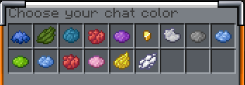

---
layout:
  title:
    visible: true
  description:
    visible: false
  tableOfContents:
    visible: true
  outline:
    visible: true
  pagination:
    visible: true
---

# 🎨 Chat color

**Permissions needed:**

* <mark style="color:orange;">`redischat.chatcolor`</mark> to execute /chatcolor and see the GUI\

* <mark style="color:orange;">`redischat.chatcolor.<chatcolor>`</mark> to use/see specific chat colors

### ChatColor GUI


```yaml
# Enable or disable the chat color GUI
enableChatColorGUI: true
```


<figure><figcaption></figcaption></figure>

**The GUI layout is configurable inside** `guis.yml`!!

You need to have redischat.chatcolor

## **`/chatcolor <color>`**

#### Examples

<mark style="color:orange;">`/chatcolor #FA8072`</mark> (format #RRGGBB)

<mark style="color:orange;">`/chatcolor white`</mark> (all colors available [here](https://docs.advntr.dev/minimessage/format.html#color))

**/chatcolor** will create a placeholder named `%redischat_chat_color%` containing a color component

Take a look at [custom-placeholderapi-placeholders.md](../unique-features/custom-placeholderapi-placeholders.md "mention") section to know more about RedisChat PAPI placeholders

You can put it before {message} inside formats section to color the text that follows

## Chatcolor reset

If the player doesn't have the permission to have the current color, (for example `redischat.chatcolor.blue`) the color will be reset on rejoin (in this case the player had the blue color and when it rejoins without the permission the color is set to "" (nothing)

