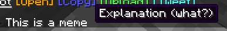

# Custom placeholders

Create content with custom Minimessage tags

And use them with \<placeholder\_name>

<figure><figcaption><p>Cringe screenshot</p></figcaption></figure>

## Configs

placeholders (list) ->&#x20;

```yaml
placeholders:
  discord: <click:open_url:https://discord.gg/idk>Click to join our discord server</click>
  meme: <hover:show_text:'Explanation (what?)'>This is a meme
```
