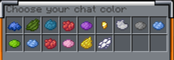

# 🖥 Display items in chat

<div data-full-width="true">

<figure><figcaption><p>&#x3C;item> tag with a shulkerbox in hand</p></figcaption></figure>

</div>

<figure><figcaption><p>&#x3C;item> tag with a spawner on right hand</p></figcaption></figure>

<figure><figcaption><p>&#x3C;inv> tag</p></figcaption></figure>

## Tags

### \<item>

Shows the item in the main hand through a clickable GUI

### \<inv>

Shows your entire inventory (and your armor slots)

### \<ec>

Shows your enderchest content


## Configs

Edit the clickable buttons in the[ format section](chat-formats.md)

```yaml
  inventory_format: <click:run_command:%command%>[Open the inventory of %player%]</click>
  item_format: <click:run_command:%command%>[%item_name% of %player%]</click>
  enderchest_format: <click:run_command:%command%>[Open the enderchest of %player%]</click>
```

%player% is the player name

Edit GUI titles

```yaml
inv_title: Inventory of %player%
item_title: Item of %player%
ec_title: Enderchest of %player%
```

### InteractiveChat compatibility


```yaml
# The [inv], [item] and [ec] placeholders will be considered as minimessage tags
interactiveChatNostalgia = false;
```


#### Bug bounty

ANY REPRODUCIBLE, NON-CLIENTSIDE DUPE GLITCH WILL BE REWARDED WITH \$$$ CONTACT ME ON DISCORD (unnm3d)
