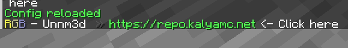

# URLs formatting

Just write in chat a URL and it will be formatted as indicated in the config section

<figure><figcaption></figcaption></figure>

## Configs

[formats](../features/chat-formats.md) (list) ->&#x20;

```yaml
link_format: <green><click:open_url:%link%>%link%</green> <- Click here
```
