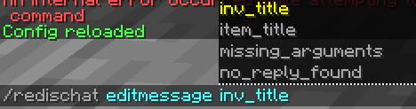
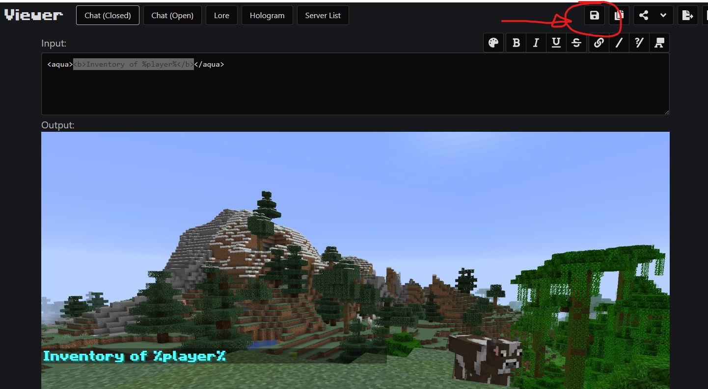

# 📝 WebUI to edit configs

<figure><figcaption></figcaption></figure>

#### &#x20;                        Step 1: Use the command /redischat editmessage \<message\_key>

&#x20;                                   \<message\_key> is the config field to modify

<figure><figcaption></figcaption></figure>

#### &#x20;                                                        Step 2: click on the link in chat

<figure><figcaption></figcaption></figure>

#### &#x20;                                            Step 3: Edit text and finally hit the save button

Step 4: paste the command in chat and hit enter: your modification would be applied to your configs.

Step 5 (Optional): reload configs with `/redischat reload`

